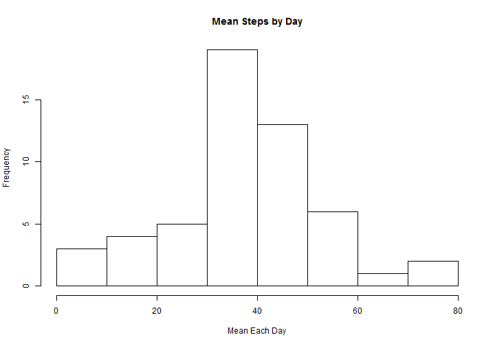
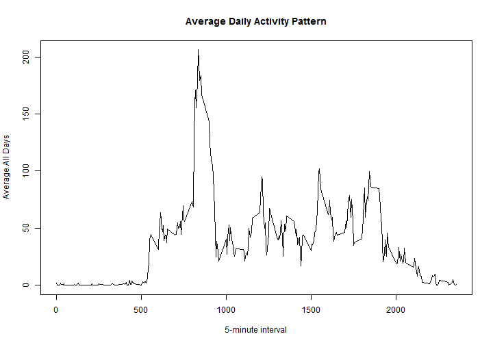
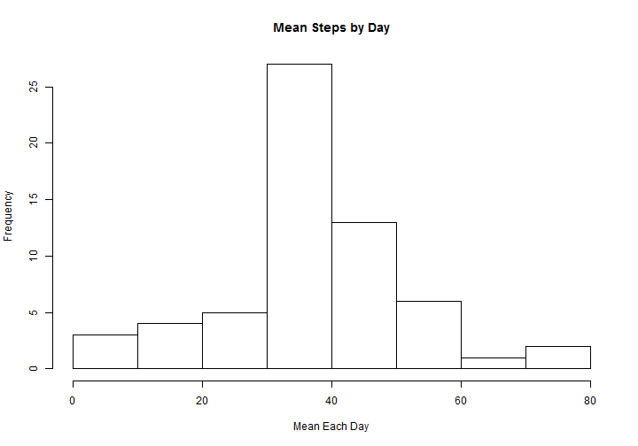
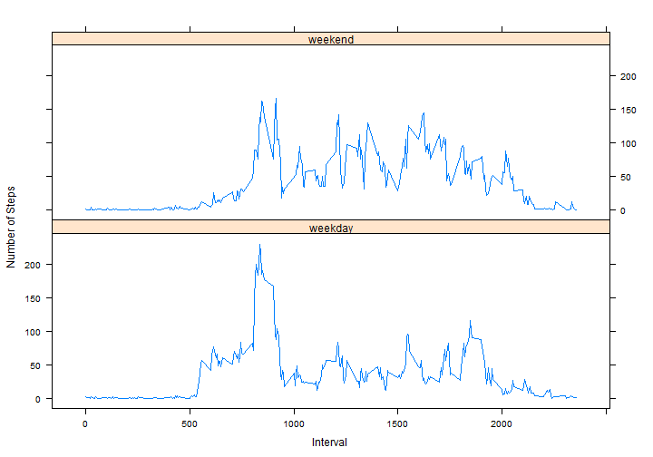

# Reproducible Research: Peer Assessment 1


## Loading and preprocessing the data

```r
data <- read.csv("activity.csv")
# data$steps<-as.numeric(data$steps)
summary(data)
```

```
##      steps               date          interval   
##  Min.   :  0.0   2012-10-01:  288   Min.   :   0  
##  1st Qu.:  0.0   2012-10-02:  288   1st Qu.: 589  
##  Median :  0.0   2012-10-03:  288   Median :1178  
##  Mean   : 37.4   2012-10-04:  288   Mean   :1178  
##  3rd Qu.: 12.0   2012-10-05:  288   3rd Qu.:1766  
##  Max.   :806.0   2012-10-06:  288   Max.   :2355  
##  NA's   :2304    (Other)   :15840
```


## What is mean total number of steps taken per day?
### Calculating the media by day and plotting the histogram

```r
data2 <- na.omit(data)
mean_each_day <- tapply(data2$steps, data2$date, mean)

hist(mean_each_day, main = "Mean Steps by Day", xlab = "Mean Each Day")
```

 

### Calculating the global media and median

```r
mean(mean_each_day, na.rm = TRUE)
```

```
## [1] 37.38
```

```r
median(mean_each_day, na.rm = TRUE)
```

```
## [1] 37.38
```


## What is the average daily activity pattern?
### Aggregating data by intervals and plotting

```r
mean_interval <- aggregate(data2$steps, by = list(data2$interval), FUN = mean, 
    na.rm = TRUE)
colnames(mean_interval) <- c("interval", "steps")
plot(mean_interval$interval, mean_interval$steps, type = "l", xlab = "5-minute interval", 
    ylab = "Average All Days", main = "Average Daily Activity Pattern")
```

 

### Getting and showing the max of steps in the media interval dataset

```r
max_interval <- mean_interval[which.max(mean_interval$steps), ]
colnames(max_interval) <- c("Interval", "Mean Steps")
max_interval
```

```
##     Interval Mean Steps
## 104      835      206.2
```

## Imputing missing values
### Number of missing values

```r
sum(!complete.cases(data))
```

```
## [1] 2304
```

### Imputing missing values by replacing them with the the mean of the 5-minute interval
### Steps
- Get a case complete dataset
- get the NA data set and replace the null values with the average of the given interval
- Put the imputed dataset with the complete dataset
- Show the characteristics of the new dataset (No NA's found)

```r
data_complete <- na.omit(data)
data_incomplete <- data[is.na(data$steps), 2:3]
data_incomplete <- merge(data_incomplete, mean_interval, by = "interval")
data_complete <- rbind(data_complete, data_incomplete)
str(data_complete)
```

```
## 'data.frame':	17568 obs. of  3 variables:
##  $ steps   : num  0 0 0 0 0 0 0 0 0 0 ...
##  $ date    : Factor w/ 61 levels "2012-10-01","2012-10-02",..: 2 2 2 2 2 2 2 2 2 2 ...
##  $ interval: int  0 5 10 15 20 25 30 35 40 45 ...
##  - attr(*, "na.action")=Class 'omit'  Named int [1:2304] 1 2 3 4 5 6 7 8 9 10 ...
##   .. ..- attr(*, "names")= chr [1:2304] "1" "2" "3" "4" ...
```

```r
sum(!complete.cases(data_complete))
```

```
## [1] 0
```

### Basic statistics and Histogram for the new dataset


```r
mean_each_day_complete <- tapply(data_complete$steps, data_complete$date, mean)

hist(mean_each_day_complete, main = "Mean Steps by Day", xlab = "Mean Each Day")
```

 

```r

mean(mean_each_day_complete)
```

```
## [1] 37.38
```

```r
median(mean_each_day_complete)
```

```
## [1] 37.38
```


## Are there differences in activity patterns between weekdays and weekends?
### Creating the new var day_of_week 

```r
Sys.setlocale("LC_TIME", "English")
```

```
## [1] "English_United States.1252"
```

```r
data_complete$day_of_week <- weekdays(as.Date(data_complete[, 2]))
data_complete$day_of_week[which(data_complete$day_of_week == "Sunday" | data_complete$day_of_week == 
    "Saturday")] <- "weekend"
data_complete$day_of_week[which(data_complete$day_of_week != "weekend")] <- "weekday"
data_complete$day_of_week <- as.factor(data_complete$day_of_week)

summary(data_complete)
```

```
##      steps               date          interval     day_of_week   
##  Min.   :  0.0   2012-10-01:  288   Min.   :   0   weekday:12960  
##  1st Qu.:  0.0   2012-10-02:  288   1st Qu.: 589   weekend: 4608  
##  Median :  0.0   2012-10-03:  288   Median :1178                  
##  Mean   : 37.4   2012-10-04:  288   Mean   :1178                  
##  3rd Qu.: 27.0   2012-10-05:  288   3rd Qu.:1766                  
##  Max.   :806.0   2012-10-06:  288   Max.   :2355                  
##                  (Other)   :15840
```

## aggregating and Plotting the data


```r
mean_interval <- aggregate(data_complete$steps, by = list(data_complete$interval, 
    data_complete$day_of_week), FUN = mean, na.rm = TRUE)

colnames(mean_interval) <- c("interval", "day_of_week", "steps")

library(lattice)
```

```
## Warning: package 'lattice' was built under R version 2.15.3
```

```r
xyplot(mean_interval$steps ~ as.numeric(mean_interval$interval) | mean_interval$day_of_week, 
    layout = c(1, 2), type = "l", xlab = "Interval", ylab = "Number of Steps")
```

 

```r

```

